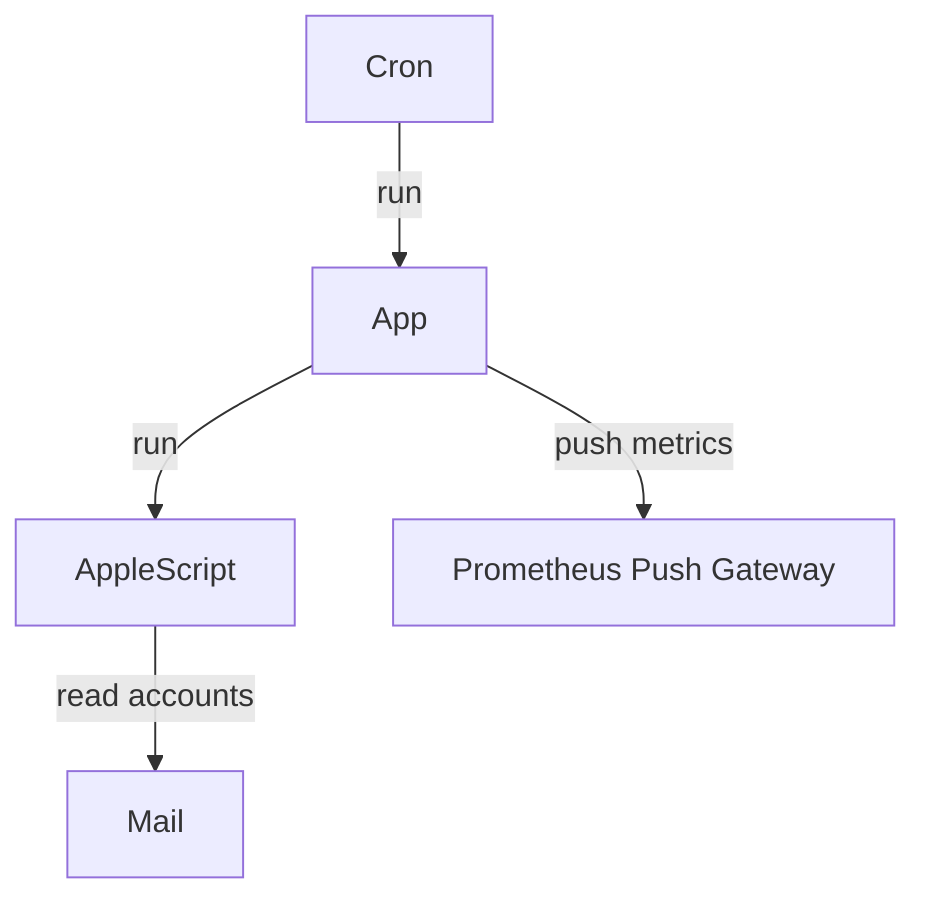

# email-counter

`email-counter` is a simple Go program that uses AppleScript to get number of emails by account in the Mail app on MacOS, then sends it to Prometheus Push Gateway. It can be triggered by a cron job.



## Local development

Try running AppleScript from the command line:

```bash
osascript counter_by_inbox.scpt
```

Build the app binary:

```bash
go build -o email-counter .
```

Run the app:

```bash
./email-counter -script=counter_by_inbox.scpt \
    -pushgateway=http://localhost:9091 \
    -metric-name=email_count \
    -job-name=email_count
```

Schedule the app to run every hour using cron:

```bash
crontab -e
```

```crontab
0 * * * * cd <path-to-directory-with-binary> && ./email-counter >> <path-to-directory-with-logs>/cron.log 2>&1
```

## References

* [Count Messages in All Mailboxes.applescript](https://github.com/github-linguist/linguist/blob/master/samples/AppleScript/Count%20Messages%20in%20All%20Mailboxes.applescript)
* [Automate running a script using crontab on macOS](https://medium.com/macoclock/automate-running-a-script-using-crontab-on-macos-88a378e0aeac)

Also see: [The Inbox-Zero Challenge: How long can you keep up your streak?](https://coda.io/d/The-Inbox-Zero-Challenge-How-long-can-you-keep-up-your-streak_dxal1e9cXAQ/The-Inbox-Zero-Challenge-How-long-can-you-keep-up-your-streak_sun_P)
